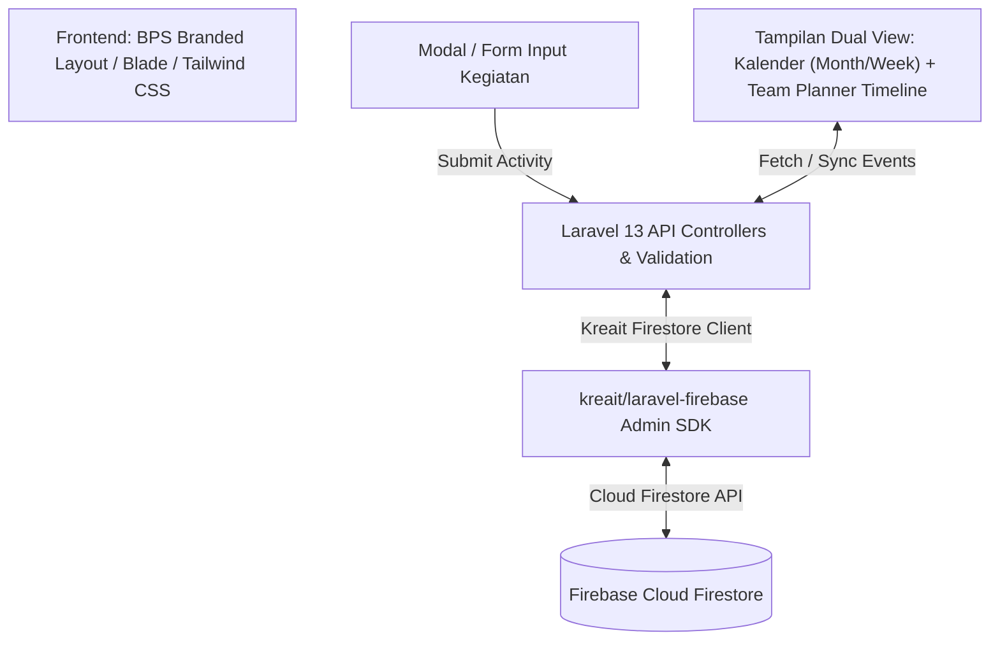

# Implementation Plan - BPS ACT (Pencatatan & Kalender Kegiatan Tim BPS)

Design and implementation strategy for **BPS ACT**, focused primarily on **Pencatatan Kegiatan/Aktivitas Tim** (Team Activity Logger) and interactive **Visualisasi Kalender & Team Planner Timeline**, built with Laravel 13, Firebase Cloud Firestore, Tailwind CSS (BPS Corporate Branding), and FullCalendar / Resource Timeline.

## Modular Architecture Overview

1. **Pencatatan Kegiatan Tim (Activity Input Engine)**:
   - Form / Modal Input Kegiatan Baru: Menyimpan `subject`, `project_id`, `assignee_id`, `start_date`, `due_date`, `status`, serta catatan deskripsi.
   - Edit & Quick Action: Klik kegiatan di kalender untuk melihat detail, mengubah status, atau mengedit informasi.

2. **Visualisasi Kalender & Team Planner**:
   - **Tampilan Kalender (Month / Week / Day Grid)**: Visualisasi menyeluruh seluruh aktivitas tim berdasarkan tanggal.
   - **Tampilan Team Planner (Resource Timeline)**: Visualisasi per-alokasi anggota tim dengan sidebar assignee `w-64`, current day highlight `bg-yellow-50`, dan interaktivitas drag-and-drop.

## Proposed Implementation Phases

### Phase 1: Environment & Firebase Integration Setup
- Initialize Laravel 13 application structure.
- Install and configure `kreait/laravel-firebase` package.
- Setup Firestore credentials configuration (`firebase_credentials.json` / `.env`).
- Create `FirestoreService` abstraction layer for querying and updating `users`, `projects`, and `work_packages` collections.

### Phase 2: Database Seeding & Mock Data
- Create Firestore Seeder command (`php artisan firestore:seed`) to populate initial seed data:
  - Work Package #742 ("Launch new website" | Catherine Johnson | Confirmed | 2026-06-08 - 2026-06-09)
  - Work Package #744 ("Press release" | Daphne Turner | In specification | 2026-06-11 - 2026-06-12)
  - Work Package #56 ("Design and Prototyping" | Leonard Douglas | In progress | 2026-03-03 - 2026-07-31)
  - Work Package #743 ("Translate website into German" | Maya Berdygylyjova | New | 2026-06-09 - 2026-06-12)

### Phase 3: API Controller & JSON Data Formatting
- Implement `TeamPlannerController`:
  - `GET /api/team-planner/resources`: Fetch users formatted for assignee rows.
  - `GET /api/team-planner/events`: Fetch work packages mapped to start_date, due_date, status tokens, and overflow flags.
  - `PATCH /api/team-planner/work-packages/{id}`: Handle drag-and-drop reschedule, duration resize, and assignee re-assignment.

### Phase 4: Frontend Layout & FullCalendar / Timeline Interactivity
- Build responsive layout with Blade & Tailwind CSS.
- Configure FullCalendar Resource Timeline / Custom Gantt grid component.
- Implement Tailwind status badges, multi-day card visual indicators, overflow date markers (`<- Mar 03, 2026` or `- Jul 31, 2026 ->`), and current-day column background (`bg-yellow-50`).
- Unassigned Work Packages drawer/pool for drag-and-drop functionality.

---

## Verification Plan

### Automated Tests
- Feature unit test for `FirestoreService` and `TeamPlannerController` endpoints.

### Manual Verification
- Test horizontal drag (reschedule start/due dates).
- Test vertical drag (change assignee_id).
- Test card edge resize (duration changes).
- Test view mode toggles (`Work week`, `Full week`, `Month`).
