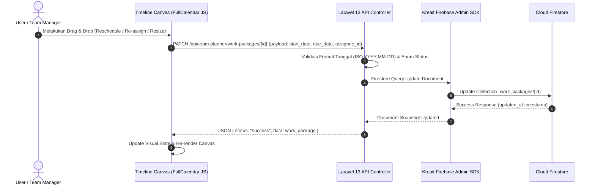
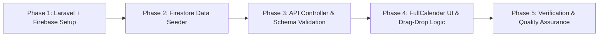

## 1. Ringkasan Eksekutif & Vision Scale
Dokumen ini menyajikan peninjauan arsitektur komprehensif dan dokumentasi teknikal spesifikasi sistem **BPS ACT (Badan Pusat Statistik Activity Tracker / Action Tracker)**.

### Vision & Modul Scalability
Sistem **BPS ACT** dirancang secara **modular & scalable** untuk memfasilitasi pengembangan fitur-fitur masa depan (seperti *Activity Analytics Report*, *Export Laporan Kegiatan*, *Performance Dashboard*, dan *Notification Engine*).

Untuk tahap **Fokus Utama (Phase 1)**, sistem berpusat pada:
1. **Fitur Utama Pencatatan Kegiatan/Aktivitas Tim**: Form & Modal input kegiatan terstruktur (Subject, Tim/Assignee, Project, Start Date, Due Date, Status, Deskripsi).
2. **Visualisasi & Manajemen Kalender / Team Planner**: Tampilan Kalender & Resource Timeline interaktif tempat seluruh kegiatan tim bermunculan, dapat dipantau, dan dikelola secara real-time (view, edit, drag-and-drop reschedule/re-assign).

---

## 2. Branding & Design System Institusional BPS

### A. Palet Warna Resmi BPS
| Peran Warna | Kode Warna (Hex) | Penggunaan UI |
| :--- | :--- | :--- |
| **Primary (Deep Blue)** | `#005AA9` | Navbar utama, Sidebar header, Active state tabs, Primary buttons |
| **Secondary (Teal / Cyan)** | `#00A6B4` | Sub-header, Grid border aksen, Hover states |
| **Accent (Green)** | `#6DBE45` | Indikator sukses, logo accent, highlight sekunder |
| **Background / Space** | `#FFFFFF` | Latar canvas grid & card container |

### B. Standard Token Tailwind CSS untuk Status Work Package
Badge status dan border card mengikuti pemetaan token warna yang ketat:

```html
<!-- Confirmed -->
<span class="bg-purple-200 text-purple-900 border border-purple-400 font-semibold px-2 py-0.5 rounded-full text-xs">Confirmed</span>
<!-- Card Border: border-t-2 border-teal-500 -->

<!-- In specification -->
<span class="bg-sky-200 text-sky-900 border border-sky-400 font-semibold px-2 py-0.5 rounded-full text-xs">In specification</span>

<!-- In progress -->
<span class="bg-purple-600 text-white font-semibold px-2 py-0.5 rounded-full text-xs">In progress</span>
<!-- Card Border: border-t-2 border-amber-600 -->

<!-- New -->
<span class="bg-teal-600 text-white font-semibold px-2 py-0.5 rounded-full text-xs">New</span>
<!-- Card Border: border-t-2 border-teal-500 -->
```

---

## 3. Diagram Arsitektur & Alur Data



---

## 4. Kontrak Data & Skema Firestore (Strict Schema)

 Database terhubung ke **Firebase Cloud Firestore** dengan skema key yang tidak boleh diubah:

### 1. Collection `users`
```json
{
  "id": "usr_catherine",
  "name": "Catherine Johnson",
  "initials": "CJ",
  "avatar_url": "https://example.com/avatars/cj.png"
}
```

### 2. Collection `projects`
```json
{
  "id": "proj_web_dev",
  "name": "Website Development",
  "color_code": "#005AA9"
}
```

### 3. Collection `work_packages`
```json
{
  "id": "742",
  "project_id": "proj_web_dev",
  "project_name": "Website Development",
  "assignee_id": "usr_catherine",
  "subject": "Launch new website",
  "status": "Confirmed",
  "start_date": "2026-06-08",
  "due_date": "2026-06-09",
  "updated_at": "2026-06-08T10:00:00Z"
}
```

---

## 5. Anatomi UI & Komponen

### A. Assignee Sidebar (Kiri)
- **Width**: Lebar tetap `w-64` (256px).
- **Search Bar**: Input filter pencarian nama anggota tim real-time (*client-side filtering*).
- **User Row**: Avatar circle / Inisial huruf, Nama lengkap, dan role/jabatan.

### B. Header Timeline & Navigasi Tanggal (Atas)
- **Date Display**: Menampilkan rentang tanggal aktif (misal: `"June 8 – 12, 2026"`).
- **Control Group**: Button `Sebelumnya`, `Selanjutnya`, `Today` dengan aksen BPS Deep Blue (`#005AA9`).
- **View Switcher Dropdown**: Opsi tampilan `Work week`, `Full week`, `Month`.

### C. Interactive Timeline Canvas (Kanan)
- **Current Day Marker**: Kolom tanggal hari ini ditandai dengan latar warna kuning lembut (`bg-yellow-50`).
- **Multi-day Card Rendering**: Card tugas yang mencakup tanggal `start_date` hingga `due_date`.
- **Overflow Indicator**: Jika durasi tugas terpotong oleh batas viewport tanggal, indikator panah ditampilkan:
  - Di sebelah kiri: `<- Mar 03, 2026`
  - Di sebelah kanan: `- Jul 31, 2026 ->`
- **Interaktivitas Canvas**:
  - Horizontal Drag: Mengubah `start_date` dan `due_date`.
  - Vertical Drag: Memindahkan tugas ke baris `assignee_id` lain.
  - Edge Resize: Memperpanjang/memperpendek durasi.

---

## 6. Matrix Initial Mock Data

| ID Work Package | Subject | Assignee | Status | Rentang Tanggal |
| :--- | :--- | :--- | :--- | :--- |
| **#742** | Launch new website | Catherine Johnson | `Confirmed` | 2026-06-08 s/d 2026-06-09 |
| **#744** | Press release | Daphne Turner | `In specification` | 2026-06-11 s/d 2026-06-12 |
| **#56** | Design and Prototyping | Leonard Douglas | `In progress` | 2026-03-03 s/d 2026-07-31 |
| **#743** | Translate website into German | Maya Berdygylyjova | `New` | 2026-06-09 s/d 2026-06-12 |

---

## 7. Rencana Eksekusi & Tahapan Pengembangan



1. **Phase 1**: Inisialisasi struktur Laravel 13 & package `kreait/laravel-firebase`.
2. **Phase 2**: Pembuatan command Firestore Seeder (`php artisan firestore:seed`) memasukkan mock data #742, #744, #56, dan #743.
3. **Phase 3**: Implementasi REST API Controller & payload handler untuk `work_packages`.
4. **Phase 4**: Pembuatan layout Blade + Tailwind CSS dengan integrasi identitas BPS dan komponen Timeline Canvas interaktif.
5. **Phase 5**: Pengujian fungsionalitas drag & drop, resize, overflow indicator, dan re-assign.
